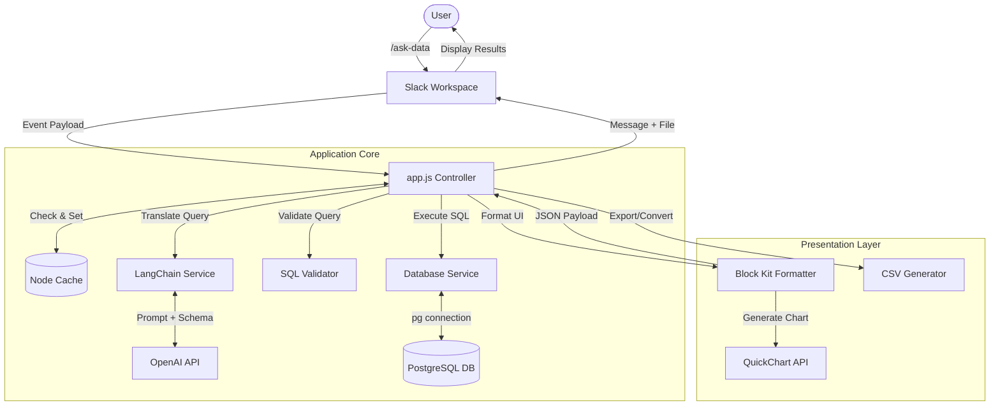

# System Architecture

The Slack AI Data Bot is built using a modern, lightweight Node.js architecture composed of the Slack Bolt framework, LangChain (for LLM orchestration), and PostgreSQL. 

The application is designed to be highly modular, with clear separation between Slack API interaction, language processing, database execution, and UI formatting.

## High-Level Data Flow

When a user executes the `/ask-data` slash command, the following pipeline occurs:



---

## Core Components

The application is structured into discrete domains:

### 1. `src/app.js` (Entry Point & Controller)
Initializes the `@slack/bolt` framework. It acts as the primary controller, listening for the `/ask-data` slash command, acknowledging the request, and orchestrating the flow between the cache, LangChain service, and the database. It also listens for `app.action('export_csv')` to handle button clicks.

### 2. `src/services/`
- **`nlToSql.js` (LangChain Service):** Contains the core logic for converting natural language to SQL. It defines the system prompt (which injects the database schema) and uses `ChatOpenAI` (`gpt-4o-mini`) to generate the exact PostgreSQL dialect query.
- **`database.js` (DB Service):** Manages a healthy connection pool to the PostgreSQL database using the `pg` library.
- **`cache.js` (Caching Service):** Utilizes `node-cache` to maintain a 5-minute TTL memory store of previously asked questions. This prevents redundant LLM API calls and DB queries for identical questions.
- **`chart.js` (Charting Service):** Inspects the database result geometries. If the results contain exactly two columns (one numeric), it generates an image URL via the open-source QuickChart API.

### 3. `src/utils/`
- **`validator.js`:** A critical security safeguard. It intercepts the LangChain-generated SQL before execution and utilizes regex targeting to ensure the query is a `SELECT` statement, targets `public.sales_daily`, and does not contain destructive keywords (e.g., `DROP`, `DELETE`).
- **`formatter.js`:** A library of functions responsible for mapping database rows and errors into Slack's proprietary Block Kit JSON format.
- **`csv.js`:** Wraps `json2csv` to instantly convert database row arrays into standard CSV strings for file upload.

---

## Database Schema

Currently, the application operates against a single, seeded table: `public.sales_daily`.

```sql
CREATE TABLE IF NOT EXISTS sales_daily (
    id SERIAL PRIMARY KEY,
    date DATE NOT NULL,
    region VARCHAR(50) NOT NULL,
    product_category VARCHAR(100) NOT NULL,
    revenue DECIMAL(10, 2) NOT NULL,
    units_sold INT NOT NULL
);
```

The system prompt in LangChain is dynamically (or statically) injected with this exact schema so the LLM knows the valid columns and types it can query against.
